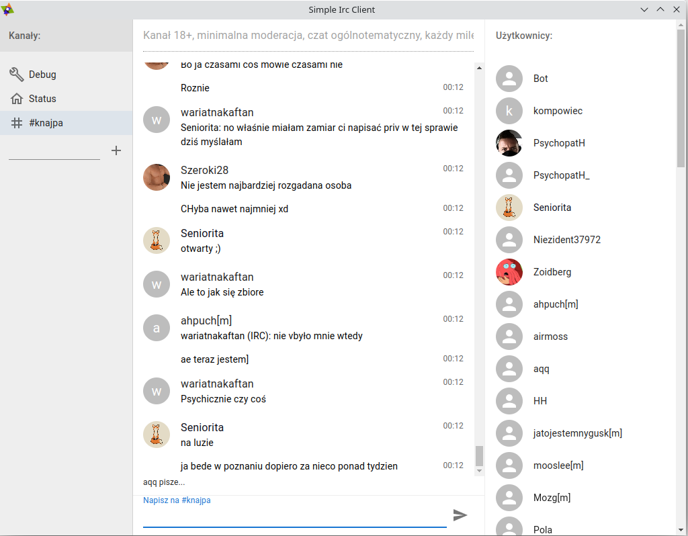

# Simple Irc Client 

Simple IRC Client is an open source project that provides a minimalist IRC client for users who don't need all the bells and whistles of a full-featured IRC client.

## Download

Latest release can be downloaded from [here](https://github.com/Simple-Irc-Client/desktop/releases)

## Contributing

If you find a bug or would like to contribute to the project, please open an issue or submit a pull request on GitHub.

## License

This project is licensed under the [Affero General Public License version 3 (AGPLv3)](https://github.com/Simple-Irc-Client/desktop/blob/main/LICENSE).

## Authors

- [Piotr Łuczko](https://www.github.com/piotrluczko)
- [Dariusz Markowicz](https://www.github.com/dmarkowicz)
